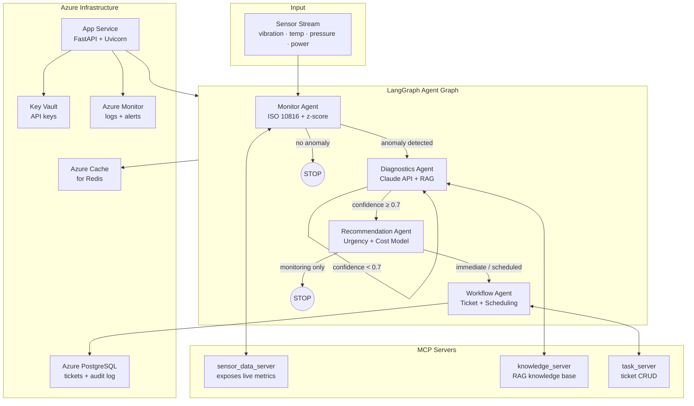

# Predictive Maintenance Multi-Agent System

> Four specialized AI agents that autonomously monitor industrial pumps, diagnose failures, and create maintenance tickets — so engineers don't have to.


---

## What It Does

Industrial factories have hundreds of pumps, motors, and compressors. Currently, engineers manually watch dashboards, consult manuals, diagnose issues, and file tickets. This system replaces that entire chain with a coordinated pipeline of four AI agents — from raw sensor data to a resolved maintenance ticket — with no human in the loop.

---

## Architecture



### Routing Logic

| From | Condition | Route To |
|------|-----------|----------|
| Monitor | Anomaly detected | Diagnostics |
| Monitor | No anomaly | **STOP** (no wasted API calls) |
| Diagnostics | Confidence ≥ 0.7 | Recommendation |
| Diagnostics | Confidence < 0.7 | Retry self (max 2×) |
| Recommendation | Action = `immediate` or `scheduled` | Workflow |
| Recommendation | Action = `monitoring` only | **STOP** (no ticket needed) |

---

## Features

- **Real-time anomaly detection** using ISO 10816 vibration severity zones and statistical z-score analysis — no LLM needed for threshold checks
- **AI-powered diagnosis** via Claude (Sonnet) querying a RAG knowledge base of maintenance manuals
- **Confidence-gated routing** — low-confidence diagnoses retry before escalating; ambiguous cases never create tickets
- **Automated maintenance tickets** persisted to PostgreSQL with severity, urgency, cost estimate, and scheduled downtime
- **Three MCP servers** exposing sensor data, knowledge base queries, and ticket management as tools
- **Streamlit monitoring dashboard** for real-time visualization of agent decisions
- **Full LLM observability** via Langfuse — traces, latency, cost per inference
- **Zero-downtime deployment** to Azure App Service via GitHub Actions CI/CD

---

## Tech Stack

### Core

| Layer | Technology | Purpose |
|-------|-----------|---------|
| Orchestration | LangGraph | Agent state machine with conditional routing |
| LLM | Claude API (Sonnet) | Diagnosis, recommendations, action planning |
| LLM Bridge | LangChain-Anthropic | Connects LangGraph nodes to Claude |
| Tool Protocol | MCP SDK | 3 custom servers for sensors, knowledge, tickets |
| API | FastAPI + Uvicorn | REST interface to the agent graph |
| Validation | Pydantic v2 | Typed models for all inter-agent data |

### Data & Storage

| Layer | Technology | Purpose |
|-------|-----------|---------|
| Vector DB | ChromaDB | RAG knowledge base (failure mode embeddings) |
| Cache / Bus | Redis | Inter-agent event bus (Pub/Sub) |
| Database | PostgreSQL (asyncpg) | Maintenance tickets, event logs, audit trail |
| PDF Parsing | PyMuPDF | Ingests maintenance manuals into ChromaDB |
| Simulation | NumPy | Generates realistic sensor data with injected faults |

### Observability & Dev

| Tool | Purpose |
|------|---------|
| Langfuse | LLM tracing — latency, token cost, prompt versions |
| Streamlit | Real-time monitoring dashboard |
| pytest + pytest-asyncio | Unit and async integration tests |
| Ruff | Linting and formatting |
| GitHub Actions | CI/CD: test → deploy to Azure |

---

## Quick Start

```bash
# 1. Clone the repository
git clone https://github.com/your-username/predictive-maintenance-agents.git
cd predictive-maintenance-agents

# 2. Create and activate a virtual environment
python -m venv .venv && source .venv/Scripts/activate   # Windows Git Bash
# python -m venv .venv && .venv\Scripts\Activate.ps1    # PowerShell

# 3. Install all dependencies
pip install -e ".[dev]"

# 4. Configure environment variables
cp .env.example .env
# Edit .env and add your ANTHROPIC_API_KEY

# 5. Start the API server
uvicorn src.api.main:app --reload --port 8000
```

Open [http://localhost:8000/docs](http://localhost:8000/docs) for the interactive Swagger UI.

> **Minimum requirement:** Only `ANTHROPIC_API_KEY` is needed to run locally. Redis and PostgreSQL fall back to defaults.

---

## API Endpoints

| Method | Path | Description |
|--------|------|-------------|
| `GET` | `/health` | Service health + agent/MCP server counts |
| `POST` | `/run` | Run the full pipeline on provided sensor readings |
| `POST` | `/simulate/{equipment_id}` | Generate synthetic sensor data and run through pipeline |
| `GET` | `/failure-modes` | Return all known failure mode definitions |

### Example: Simulate a bearing wear event

```bash
curl -X POST http://localhost:8000/simulate/PUMP-001 \
  -H "Content-Type: application/json" \
  -d '{"anomaly_type": "bearing_wear", "reading_count": 100}'
```

```json
{
  "anomalies": [{"equipment_id": "PUMP-001", "severity": "warning", "type": "bearing_wear"}],
  "diagnosis": {"failure_mode": "bearing_wear", "confidence": 0.87, "explanation": "..."},
  "actions": [{"action": "schedule_bearing_replacement", "urgency": "scheduled", "cost_of_inaction_eur": 4200}],
  "ticket_id": "TKT-2025-001"
}
```

---

## Project Structure

```
predictive-maintenance-agents/
├── src/
│   ├── agents/          # LangGraph state machine + 4 agent nodes
│   │   ├── state.py     # Single source of truth for all Pydantic models
│   │   ├── supervisor.py # Graph definition with conditional routing
│   │   ├── monitor_agent.py
│   │   ├── diagnostics_agent.py
│   │   ├── recommendation_agent.py
│   │   └── workflow_agent.py
│   ├── mcp_servers/     # 3 MCP servers (sensor data, knowledge, tickets)
│   ├── data/            # Sensor simulator + anomaly injector
│   ├── knowledge/       # ChromaDB vector store + PDF ingestion pipeline
│   ├── api/             # FastAPI app, routes, Pydantic schemas
│   ├── monitoring/      # Streamlit dashboard + structured logger
│   └── config/          # Pydantic Settings — reads .env into typed config
├── tests/
│   ├── unit/            # Per-agent unit tests (mocked Claude API)
│   └── integration/     # Full pipeline end-to-end tests
├── .github/workflows/   # CI/CD: test → deploy to Azure App Service
├── pyproject.toml
└── .env.example
```

---

## Anomaly Patterns

The system detects three failure modes grounded in real industrial mechanics. Each injects a physically accurate sensor signature:

| Pattern | Root Cause | Vibration | Temperature | Pressure | Power |
|---------|-----------|-----------|-------------|----------|-------|
| **Bearing Wear** | Lubricant degrades → friction → heat | Gradual rise | Gradual rise | Normal | Normal |
| **Cavitation** | Inlet pressure below vapor point → bubble collapse | Erratic spikes | Normal | Sudden drop | Normal |
| **Misalignment** | Shaft offset → uneven load on motor | Constant high | Normal | Normal | +15% rise |

### ISO 10816 Vibration Severity Zones (Class III — Pumps)

| Zone | Vibration (mm/s RMS) | Meaning |
|------|---------------------|---------|
| A — Good | 0 – 2.8 | Newly commissioned, healthy operation |
| B — Acceptable | 2.8 – 7.1 | Suitable for continuous long-term operation |
| C — Warning | 7.1 – 11.2 | Not suitable long-term — plan maintenance |
| D — Critical | > 11.2 | Active damage occurring — stop immediately |

---

## Azure Deployment

The system is designed to deploy to **Azure App Service** (no Docker required) with managed Redis and PostgreSQL.

For full setup instructions including:
- Provisioning Azure resources with the CLI
- Configuring Azure Key Vault for secrets
- Setting up the GitHub Actions CI/CD pipeline
- Environment variable configuration

See [AZURE_SETUP.md](AZURE_SETUP.md).

### Services Used

| Service | Tier | Purpose |
|---------|------|---------|
| Azure App Service | B1 Basic | Hosts the FastAPI application |
| Azure Cache for Redis | Basic C0 | Agent event bus |
| Azure Database for PostgreSQL | Burstable B1ms | Tickets and event storage |
| Azure Key Vault | Free | Secure API key management |
| Azure Monitor | Free (5 GB/month) | Logs and alerts |

---

## Testing

```bash
# Run the full test suite
pytest tests/ -v

# Run only unit tests (no external services required)
pytest tests/unit/ -v

# Run only integration tests
pytest tests/integration/ -v

# Run tests matching a keyword
pytest tests/ -v -k "bearing"

# Run with stdout visible
pytest tests/ -v -s
```

All unit tests mock the Claude API — no real API calls are made. Integration tests require Redis and PostgreSQL (or use the provided test fixtures with in-memory fallbacks).

---

## Engineering Background

The anomaly detection logic is not arbitrary — it's grounded in real mechanical engineering practice.

**ISO 10816** is the international standard for evaluating vibration severity on rotating machinery. The four severity zones (A through D) are directly used by the Monitor Agent to classify vibration readings before any LLM is involved. This matters because a threshold check should never require a 200ms API call.

The three failure modes were chosen because they represent the most common causes of centrifugal pump downtime in heavy industry:

- **Bearing wear** follows a classic heat-friction feedback loop well understood in tribology. Early-stage bearing wear is invisible to operators but produces a measurable vibration and temperature signature weeks before failure.
- **Cavitation** is particularly destructive — the collapse of vapor bubbles generates micro-shockwaves that erode impeller metal. Its pressure signature (sudden inlet drop with stable temperature) is distinct and detectable without ambiguity.
- **Misalignment** is typically a maintenance error — improper reassembly after a repair. It loads the motor asymmetrically, raising power draw while vibration stays persistently elevated rather than spiking.

The Diagnostics Agent uses Claude to reason over these patterns against a RAG knowledge base of maintenance manuals, rather than hardcoded rules — making the system extensible to any failure mode with sufficient documentation.

---

## License

MIT License — see [LICENSE](LICENSE) for details.
